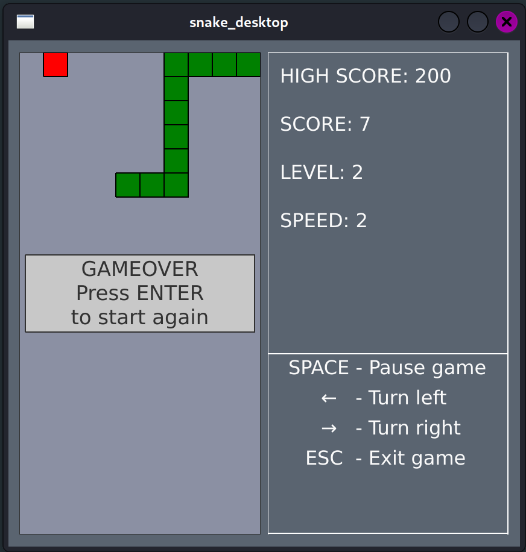
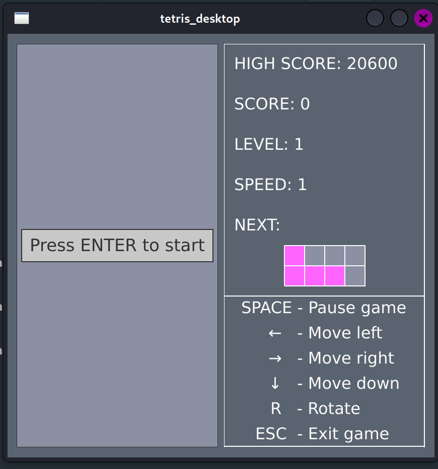
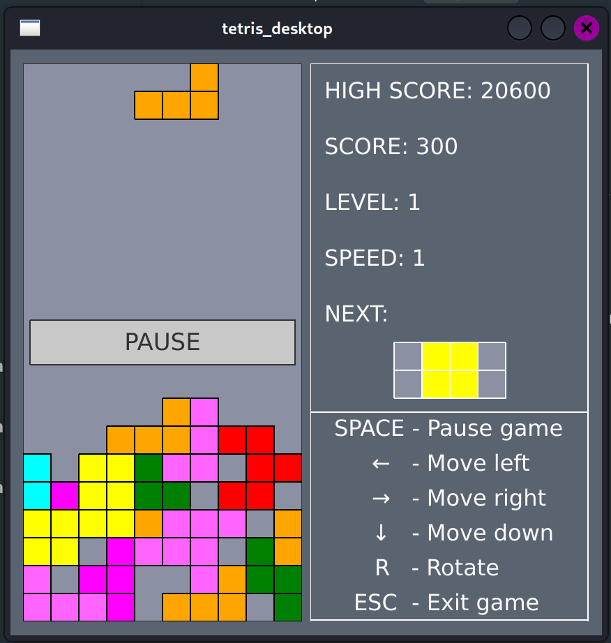
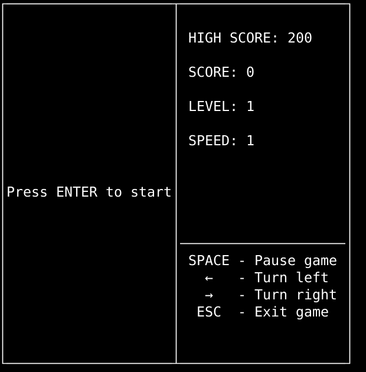
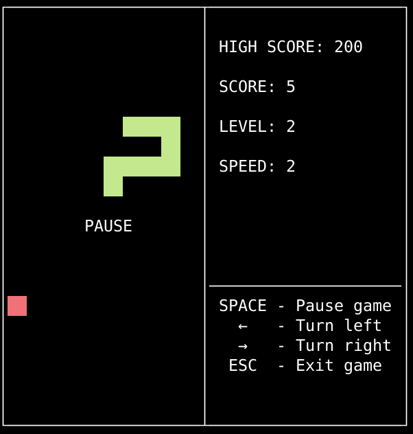
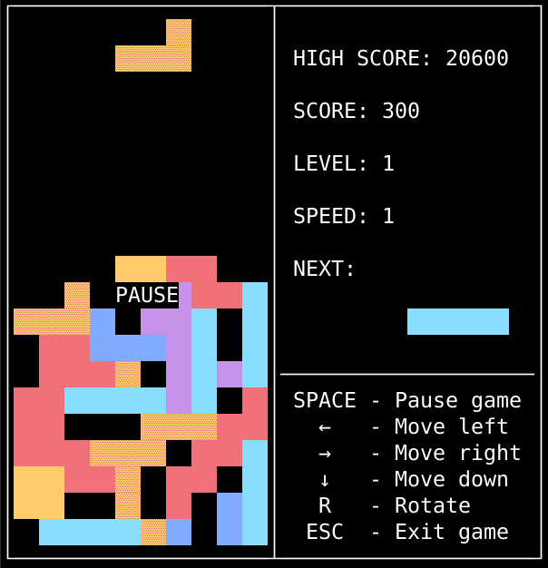

# BrickGame Snake

Проект в рамках базовой программы Школы 21. Школа 21 - образовательный проект от Сбер для разработчиков.

Представлена реализация игры Змейка на С++. Использован паттерн MVC.
Логика игры вынесена в отдельную библотеку. Библиотека подключается к GUI через контроллер.
GUI представлен двумя вариантами CLI (библиотека ncurses) и Desktop (библиотека Qt).
Бонусом подключена реализация игры [Тетрис](https://github.com/JustDoItVV/s21_tetris) также через паттерн MVC
и в двух вариантах графического интерфейса.
Библиотеки обоих игр покрыты юнит тестами.

## Требования

- pkg-config
- cmake
- ncurses
- Qt5+
- gtest
- gcovr
- doxygen

## Установка

Из папки `src` выполнить

```shell
make
```

Исполняемые файлы в папке `src/build`:

- snake_cli
- snake_desktop
- tetris_cli
- tetris_desktop

## Скриншоты








